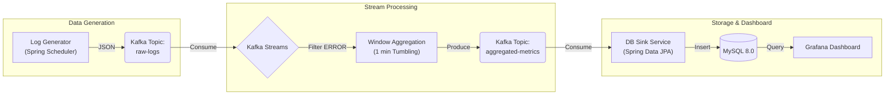
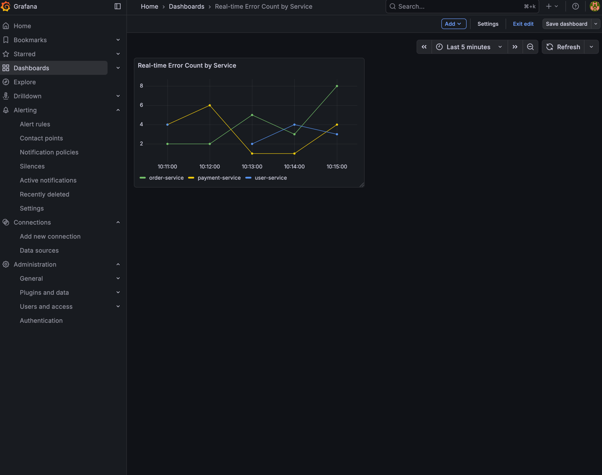

# 🚀 Real-time Log Analysis Pipeline with Kafka Streams


## 📖 Project Overview
**"자바 백엔드 아키텍처를 활용한 초지연(Low-latency) 로그 분석 파이프라인"**

이 프로젝트는 대규모 분산 환경에서 발생할 수 있는 서비스 로그를 **실시간으로 수집, 필터링, 집계**하여 시각화하는 End-to-End 데이터 파이프라인입니다.
기존의 배치 처리(Batch Processing) 방식이 아닌, **Event-Driven Architecture**를 기반으로 하여 장애 발생 시 즉각적인 인지가 가능하도록 설계했습니다.

### 🎯 Key Objectives
*   **Real-time Processing:** 데이터 생성 즉시 1분 단위 Window Aggregation 수행.
*   **Java 21 Modernization:** `Record`, `Virtual Threads`, `RandomGenerator` 등 최신 Java 스펙 활용.
*   **MSA Friendly:** 별도의 Spark 클러스터 없이 애플리케이션 내장형 **Kafka Streams** 라이브러리 활용.
*   **Infrastructure as Code:** Docker Compose를 이용한 원클릭 환경 구축.

---

## 🏗 Architecture



1.  **Ingestion:** Spring Scheduler를 이용해 실제 운영 환경과 유사한 패턴(가우시안 분포)의 로그 생성.
2.  **Streaming:** Kafka Streams를 활용하여 `ERROR` 레벨 로그만 필터링 후, 서비스별로 1분 단위 카운트 집계.
3.  **Sink:** 집계된 데이터를 MySQL에 영구 저장 (Transaction 관리).
4.  **Visualization:** Grafana와 MySQL을 연동하여 실시간 시계열 그래프 제공.

---

## 🛠 Tech Stack & Decision Making

이 프로젝트에서 **왜 이 기술을 선택했는지**에 대한 의사결정 과정입니다.

| Category | Technology | Reason for Selection (Decision Point) |
| :--- | :--- | :--- |
| **Language** | **Java 21** | LTS 최신 버전. `Record`를 통한 불변 데이터 모델링 및 가독성 향상. 향후 Virtual Threads 도입을 통한 I/O 처리량 증대 고려. |
| **Streaming** | **Kafka Streams** | Spark Streaming 대비 **인프라 복잡도가 낮고(No Cluster)**, Java 백엔드 로직과의 통합이 용이하여 **MSA 구조에 최적화**됨. |
| **Message Queue** | **Apache Kafka** | 고가용성 및 내결함성을 가진 업계 표준 이벤트 브로커. |
| **Storage** | **MySQL 8.0** | 집계된 결과 데이터(Metrics)는 정형 데이터이므로 RDBMS가 적합하다고 판단. (로그 원본 검색엔 ElasticSearch가 적합하나, 본 프로젝트는 '지표 집계'에 집중) |
| **Viz** | **Grafana** | 다양한 데이터 소스(MySQL)를 지원하며 커스터마이징이 강력한 대시보드 도구. |

---

## 💻 Getting Started

### Prerequisites
*   Java 21 SDK
*   Docker & Docker Compose

### 1. Infrastructure Setup
Kafka, Zookeeper, MySQL, Grafana 컨테이너를 실행합니다.
```bash
cd infra
docker-compose up -d
```
*   **Kafka UI:** `http://localhost:8080` (토픽 및 메시지 확인)
*   **Grafana:** `http://localhost:3000` (계정: `admin` / `admin`)

### 2. Run Application
Spring Boot 애플리케이션을 실행하여 로그 생성 및 스트림 처리를 시작합니다.
```bash
./gradlew bootRun
```

### 3. Monitoring
1.  애플리케이션 실행 후 약 1분 대기 (첫 윈도우 집계 시간).
2.  Grafana 접속 후 **MySQL DataSource** 연결 (`host: mysql`, `db: log_db`).
3.  대시보드 생성 및 Query 입력:
    ```sql
    SELECT window_end as time, error_count as value, service_name as metric
    FROM error_metrics
    ORDER BY window_end ASC
    ```

---

## 🔍 Code Highlights (Modern Java)

### 1. Java 16+ `Record` for DTO
Lombok의 의존성을 줄이고, 데이터 불변성(Immutability)을 보장하기 위해 `Record`를 적극 도입했습니다.
```java
public record AggregatedLogMetric(
    String windowStart,
    String windowEnd,
    String serviceName,
    String logLevel,
    Long errorCount
) {}
```

### 2. Java 17+ `RandomGenerator`
멀티스레드 환경에서 더 나은 성능과 난수 품질을 제공하는 `RandomGenerator`를 사용했습니다.
```java
private final RandomGenerator random = RandomGenerator.getDefault();
// ...
long responseTime = random.nextInt(500, 1500); // 직관적인 범위 지정
```

---

## 📈 Results

*   **Kafka UI:** `raw-logs` 및 `aggregated-metrics` 토픽 데이터 흐름 확인.
*   **Grafana:** 실시간으로 변하는 에러 발생 추이 그래프.
    
---

## 🚀 Future Improvements
*   **Schema Registry 도입:** Avro 포맷을 적용하여 스키마 변경에 대한 유연성 확보.
*   **Elasticsearch Sink 추가:** 원본 로그에 대한 전문 검색(Full-text Search) 기능 구현.
*   **Dead Letter Queue (DLQ):** 처리 실패한 메시지에 대한 재처리 로직 고도화.

---

### 📝 License
This project is licensed under the MIT License.